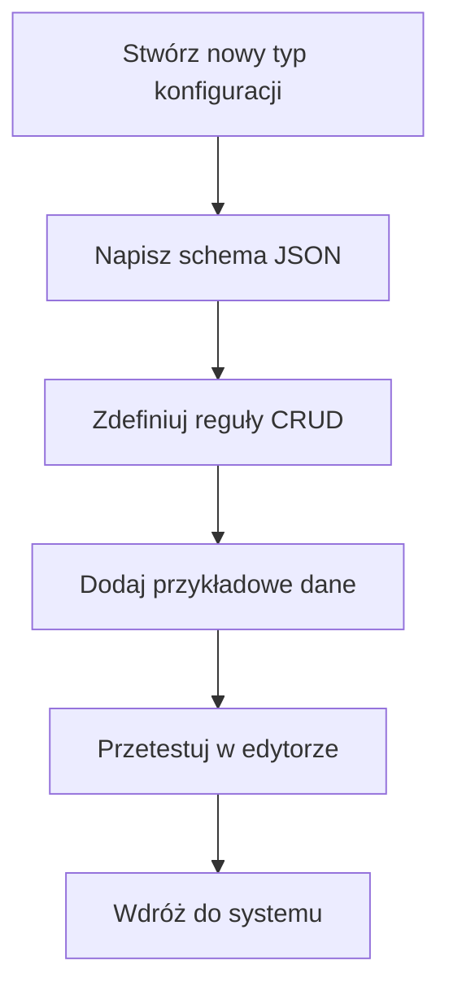
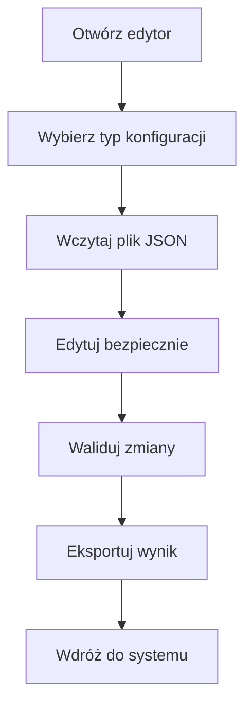
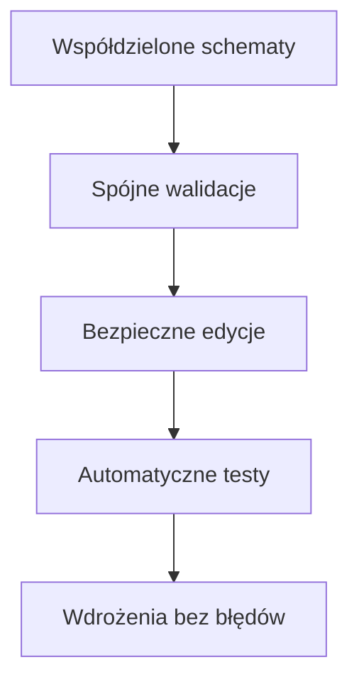

# 📁 Struktura Projektu - Modularny Edytor JSON

## 🏗️ **Architektura Systemu**

```
json-config-editor/
├── 📄 json-config-editor.html          # Główny edytor (standalone)
├── 📂 schemas/                          # Schematy walidacji
│   ├── app-schema.json                  # Schema dla app.json
│   ├── menu-schema.json                 # Schema dla menu.json
│   ├── router-schema.json               # Schema dla router.json
│   ├── system-schema.json               # Schema dla system.json
│   ├── test-scenarios-schema.json       # Schema dla test-scenarios.json
│   └── workshop-schema.json             # Schema dla workshop.json
├── 📂 crud-rules/                       # Reguły edycji CRUD
│   ├── app-crud.json                    # Reguły dla app.json
│   ├── menu-crud.json                   # Reguły dla menu.json
│   ├── router-crud.json                 # Reguły dla router.json
│   ├── system-crud.json                 # Reguły dla system.json
│   ├── test-scenarios-crud.json         # Reguły dla test-scenarios.json
│   └── workshop-crud.json               # Reguły dla workshop.json
├── 📂 data/                             # Przykładowe dane
│   ├── app.json                         # Przykład app.json
│   ├── menu.json                        # Przykład menu.json
│   ├── router.json                      # Przykład router.json
│   ├── system.json                      # Przykład system.json
│   ├── test-scenarios.json              # Przykład test-scenarios.json
│   └── workshop.json                    # Przykład workshop.json
├── 📂 docs/                             # Dokumentacja
│   ├── usage-guide.md                   # Przewodnik użytkowania
│   └── integration-example.js           # Przykład integracji
└── 📄 README.md                         # Główna dokumentacja
```

---

## 🔄 **Przepływ Pracy**

### **1. 👨‍💻 Dla Developera**



**Kroki szczegółowe:**
1. **Schema JSON** - zdefiniuj strukturę, typy, walidację
2. **CRUD Rules** - określ co można edytować/dodawać/usuwać
3. **Sample Data** - stwórz przykładowe dane do testów
4. **Testing** - przetestuj w wizualnym edytorze
5. **Integration** - zintegruj z aplikacją produkcyjną

### **2. 🧑‍🔧 Dla Administratora**



**Kroki szczegółowe:**
1. **Load** - wczytaj istniejącą konfigurację lub przykład
2. **Edit** - modyfikuj tylko dozwolone pola (zielone)
3. **Validate** - sprawdź zgodność ze schematem
4. **Export** - wyeksportuj poprawiony JSON
5. **Deploy** - zastąp plik w systemie produkcyjnym

### **3. 👥 Dla Zespołu**



---

## ⚙️ **Konfiguracja Środowiska**

### **Standalone (tylko HTML)**
```html
<!-- Wystarczy otworzyć w przeglądarce -->
json-config-editor.html
```
**Zalety:**
- ✅ Brak zależności
- ✅ Działa offline
- ✅ Łatwe udostępnianie

### **Node.js Integration**
```bash
npm install ajv express fs path
node integration-example.js
```
**Zalety:**
- ✅ API endpoints
- ✅ Automatyczna walidacja
- ✅ Kontrola uprawnień

### **Docker Container**
```dockerfile
FROM node:18-alpine
WORKDIR /app
COPY . .
RUN npm install
EXPOSE 3000
CMD ["node", "integration-example.js"]
```

---

## 🎯 **Przypadki Użycia**

### **Case 1: Startup - Szybka konfiguracja**
```
Potrzeba: Prosta edycja plików konfiguracyjnych
Rozwiązanie: Standalone HTML editor
Czas wdrożenia: 5 minut
```

### **Case 2: Średnia firma - Bezpieczna edycja**
```
Potrzeba: Kontrola uprawnień, walidacja
Rozwiązanie: HTML editor + custom schemas
Czas wdrożenia: 2 godziny  
```

### **Case 3: Enterprise - Pełna integracja**
```
Potrzeba: API, role, audit trail, backup
Rozwiązanie: Node.js integration + database
Czas wdrożenia: 1-2 dni
```

---

## 📊 **Porównanie Rozwiązań**

| Funkcja | Standalone | Node.js | Enterprise |
|---------|------------|---------|------------|
| **Edycja wizualna** | ✅ | ✅ | ✅ |
| **Walidacja schema** | ✅ | ✅ | ✅ |
| **Control CRUD** | ✅ | ✅ | ✅ |
| **API endpoints** | ❌ | ✅ | ✅ |
| **Role użytkowników** | ❌ | ⚠️ | ✅ |
| **Audit log** | ❌ | ⚠️ | ✅ |
| **Backup/versioning** | ⚠️ | ✅ | ✅ |
| **Real-time sync** | ❌ | ⚠️ | ✅ |

**Legenda:**
- ✅ Pełne wsparcie
- ⚠️ Podstawowe wsparcie / wymaga customizacji  
- ❌ Brak wsparcia

---

## 🔧 **Rozbudowa Systemu**

### **Dodawanie Nowych Typów**

**1. Stwórz schema:**
```json
{
  "type": "object",
  "title": "Nowy Typ Konfiguracji",
  "properties": {
    "setting1": { "type": "string" },
    "setting2": { "type": "number" }
  }
}
```

**2. Stwórz reguły CRUD:**
```json
{
  "name": "nowy-typ",
  "rules": {
    "editable": ["setting1", "setting2"],
    "addable": false,
    "deletable": false
  }
}
```

**3. Dodaj do edytora:**
```html
<option value="nowy-typ">Nowy Typ</option>
```

### **Integracja z Backend Systems**

**Database Storage:**
```javascript
// MongoDB integration
const mongoose = require('mongoose');
const configSchema = new mongoose.Schema({
    type: String,
    data: Object,
    lastModified: Date,
    modifiedBy: String
});
```

**Redis Caching:**
```javascript
// Cache schemas in Redis
const redis = require('redis');
const client = redis.createClient();

await client.setex(`schema:${type}`, 3600, JSON.stringify(schema));
```

**Event Logging:**
```javascript
// Audit trail
const auditLog = {
    timestamp: new Date(),
    user: req.user.id,
    action: 'UPDATE_CONFIG',
    type: req.params.type,
    changes: diff(oldData, newData)
};
```

---

## 🧪 **Testing Strategy**

### **Unit Tests**
```javascript
describe('ConfigManager', () => {
    test('validates app.json correctly', () => {
        const config = { API_URL: 'invalid-url' };
        const result = configManager.validateConfig('app', config);
        expect(result.valid).toBe(false);
    });
    
    test('blocks editing protected fields', () => {
        expect(() => {
            configManager.updateField('workshop', 'spare_parts/default_parts/0/id', 'NEW');
        }).toThrow('Field is not editable');
    });
});
```

### **Integration Tests**
```javascript
describe('API Endpoints', () => {
    test('GET /api/config/app returns valid config', async () => {
        const response = await request(app).get('/api/config/app');
        expect(response.status).toBe(200);
        expect(response.body.validation.valid).toBe(true);
    });
});
```

### **E2E Tests**
```javascript
describe('Editor UI', () => {
    test('user can edit allowed fields', async () => {
        await page.click('[data-field="API_URL"]');
        await page.type('input', 'https://new-api.com');
        await page.press('Enter');
        
        const value = await page.$eval('[data-field="API_URL"]', el => el.textContent);
        expect(value).toBe('"https://new-api.com"');
    });
});
```

---

## 🚀 **Deployment Options**

### **Static Hosting (GitHub Pages, Netlify)**
```yaml
# .github/workflows/deploy.yml
name: Deploy Editor
on: push
jobs:
  deploy:
    runs-on: ubuntu-latest
    steps:
      - uses: actions/checkout@v2
      - name: Deploy to GitHub Pages
        uses: peaceiris/actions-gh-pages@v3
```

### **Docker Deployment**
```bash
# Build image
docker build -t json-config-editor .

# Run container
docker run -p 3000:3000 -v ./configs:/app/data json-config-editor
```

### **Kubernetes Deployment**
```yaml
apiVersion: apps/v1
kind: Deployment
metadata:
  name: config-editor
spec:
  replicas: 2
  selector:
    matchLabels:
      app: config-editor
  template:
    spec:
      containers:
      - name: config-editor
        image: json-config-editor:latest
        ports:
        - containerPort: 3000
```

---

## 📈 **Metryki i Monitoring**

### **Application Metrics**
```javascript
// Prometheus metrics
const promClient = require('prom-client');

const configValidations = new promClient.Counter({
    name: 'config_validations_total',
    help: 'Total number of config validations',
    labelNames: ['type', 'valid']
});

const configUpdates = new promClient.Counter({
    name: 'config_updates_total', 
    help: 'Total number of config updates',
    labelNames: ['type', 'user']
});
```

### **Error Tracking**
```javascript
// Sentry integration
const Sentry = require('@sentry/node');

Sentry.captureException(error, {
    tags: {
        configType: type,
        operation: 'validate'
    },
    extra: {
        configData: data,
        validationErrors: errors
    }
});
```

---

## 🎨 **Customization Guide**

### **Własne Style CSS**
```css
/* Dostosuj kolory dla swojej marki */
.json-key.editable {
    background: #your-brand-color;
    border-color: #your-accent-color;
}
```

### **Własne Walidatory**
```javascript
// Dodaj custom format validator
ajv.addFormat('polish-phone', function(data) {
    return /^\+48\s\d{3}\s\d{3}\s\d{3}$/.test(data);
});
```

### **Własne Typy Pól**
```javascript
// Dodaj nowy typ pola
const fieldTypes = {
    'polish-pesel': {
        validator: (value) => validatePESEL(value),
        formatter: (value) => formatPESEL(value),
        placeholder: '85010112345'
    }
};
```

Ten system zapewnia **pełną kontrolę** nad konfiguracją przy zachowaniu **maksymalnego bezpieczeństwa** i **łatwości użycia**! 🚀